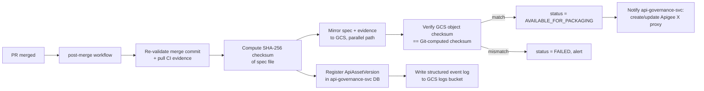
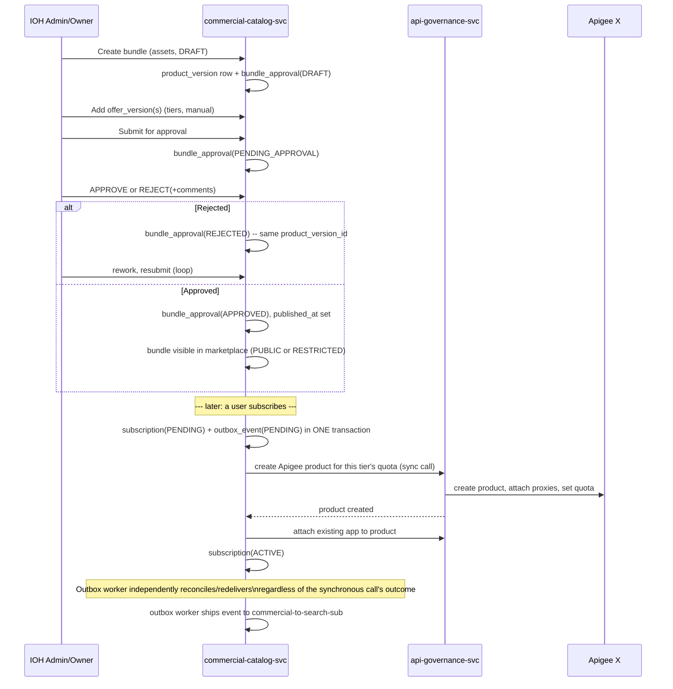

# API Onboarding, Governance & Productization — Design Document

## Context

IOH needs a governed path that takes an OpenAPI 3.1 contract from "a developer's draft in Git" to "a real, callable, sellable API product." Today there is no such pipeline: no fixed identity scheme for APIs, no enforced Git layout, no automated pre-merge governance gates, no immutable version registry, and no defined path from an approved spec to an Apigee X proxy and a commercial-catalog product with tiered offers. This document is the technical design for that end-to-end flow — from `git push` through CI validation, merge, GCS mirroring, Apigee X proxy creation, bundle/product/offer productization, and subscription activation via a transactional-outbox event pipeline.

Decisions below were made together with you (see "Decisions confirmed with you" per section) and are treated as fixed for this design. Wherever the original ask left something unspecified and low-risk, I made a reasonable default and called it out under **Open items / assumptions** at the end rather than block on it — flag any of those you want changed.

Stack assumptions used throughout: **GitHub + GitHub Actions** for source/CI, **GCP** for storage/compute (GCS, Cloud SQL, Pub/Sub), **Apigee X** for API management — consistent with the GCS bucket and Apigee X requirements already stated.

---

## 1. The `api-id` — permanent API identity

**Decision confirmed with you:** human-readable slug, built from domain + resource, not a random/opaque ID.

### Format

```
api-id := {namespace}-{resource-slug}
```

- **`namespace`** — for IOH-owned APIs, the owning business domain (e.g. `payments`, `logistics`, `identity`). For vendor APIs, the `vendor-org-id` (e.g. `acme-corp`). This guarantees an IOH API and a vendor API can never collide even with an identical resource name.
- **`resource-slug`** — short, kebab-case name for the resource/capability (e.g. `wallet-transfer`, `shipment-tracking`).
- Full id example: `payments-wallet-transfer`, `acme-corp-shipment-tracking`.

**Format rules (enforced by CI):**
- lowercase `[a-z0-9-]`, 3–63 characters (safe for use as an Apigee proxy/basePath segment and a DNS-safe label everywhere downstream).
- must start and end with a letter/number, no consecutive hyphens.
- reserved words blocked (`v1`, `v2`, `api`, `vendor`, `ioh`, `apis`, etc.).

### How it's declared and guaranteed permanent

1. The submitter proposes the api-id **twice, redundantly, and CI checks they agree**:
   - As the Git folder path: `ioh/apis/{api-id}/v1/openapi.yaml` (or `vendor/{vendor-org-id}/apis/{api-id}/v1/openapi.yaml`).
   - As a field inside the spec itself: `info.x-ioh-api-id`. This makes the spec self-describing once it's copied out of Git (into GCS, into Apigee, into the catalog) — nothing downstream has to "remember" the file's original path.
2. **Git itself is the uniqueness registry** — no separate database of claimed ids. The pre-merge CI job checks whether `ioh/apis/{api-id}/` or `vendor/*/apis/{api-id}/` already exists anywhere in the repo's default branch:
   - If it doesn't exist → this PR is claiming a **new** api-id. It's granted permanently the moment the PR merges.
   - If it exists → this PR must be a new version under that *same* api-id (adding a `v2/` folder, or a new commit inside an existing `vN/`), never a redefinition of what the id refers to.
3. **Immutability enforcement:** CI rejects any PR that deletes an existing `apis/{api-id}/` path (or the folder itself) — a delete-and-recreate is indistinguishable from "reassigning" a permanent id and is blocked outright. Retiring an API is a `lifecycle_status = RETIRED` metadata change (see §2), never a folder deletion.
4. A generated, non-authoritative index (`_index/api-ids.json`, regenerated by the post-merge job) gives O(1) lookups for the CI uniqueness check instead of walking the whole tree on every PR. Git itself remains the source of truth; the index is just a cache.

---

## 2. Git folder structure

**Decision confirmed with you:** vendors submit through the **same repo**, in a vendor-scoped folder, under the same CI/branch-protection gates as internal IOH developers.

```
/
├── ioh/
│   └── apis/
│       └── {api-id}/
│           ├── metadata.yaml          # identity-level info, not version-specific
│           ├── v1/
│           │   └── openapi.yaml
│           └── v2/                    # only created via the approved breaking-change transition (§5)
│               └── openapi.yaml
│
├── vendor/
│   └── {vendor-org-id}/
│       └── apis/
│           └── {api-id}/
│               ├── metadata.yaml
│               └── v1/
│                   └── openapi.yaml
│
├── .github/
│   ├── workflows/                     # CI pipeline (§3)
│   └── CODEOWNERS                     # domain-owner approval for ioh/**, governance-team approval for vendor/**
└── _index/
    └── api-ids.json                   # generated cache, not authoritative
```

**Reasoning:**

| Choice | Why |
|---|---|
| `ioh/` vs `vendor/` split at top level | Different trust boundary. Different `CODEOWNERS` rules, different branch-protection strictness, different rate of change. A vendor can never accidentally (or maliciously) touch an `ioh/` path — it's a different directory tree with different required reviewers. |
| `apis/{api-id}/` as the identity node | Every version of an API lives under one permanent folder, so lineage (v1 → v2) is a simple directory listing and diffing v1 vs v2 is a normal Git diff across folders. |
| `vN/` folders are **major versions only** | Per the breaking-change decision (§5), a new `vN/` folder is only created through the approved version-transition process. Minor/patch releases (`info.version` semver bumps like `1.2.0 → 1.3.0`) are just new commits to the *same* `v1/openapi.yaml` file — Git history + the OAS `info.version` field track that. This keeps the number of folders bounded to actual shape-incompatible generations instead of one folder per release. |
| Fixed filename `openapi.yaml` (or `.json`, exactly one) | Deterministic for every downstream consumer (CI, GCS mirror, api-governance-svc, Apigee import) — no directory-listing heuristics needed to find "the spec." |
| `metadata.yaml` per api-id, not per version | Holds things that don't change per version: owning domain/team, vendor-org-id, contact, `lifecycle_status` (ACTIVE / DEPRECATED / RETIRED). Keeps version folders purely about the contract itself. |
| `CODEOWNERS` per path prefix | This is *literally* how "IOH admin approval" and "merge-gate reviewer approval" become the same step (§6) — the required reviewer for a path *is* the IOH admin for that domain. |

---

## 3. Pre-merge CI pipeline (GitHub Actions)

Triggered on `pull_request` against the default branch, path-filtered to `ioh/**` and `vendor/**`. Each of your 8 required checks maps to a job:

| # | Requirement | Job | Mechanism |
|---|---|---|---|
| 1 | Validate OAS 3.1 structure | `validate-oas-structure` | Parse with an OAS 3.1–aware validator (Redocly CLI / openapi-core); fail on parse error or schema violation. |
| 2 | IOH API linting | `lint-ioh-conventions` | Spectral with a custom `ioh-ruleset.yaml` — required metadata, description completeness, tag usage, general contract-quality rules. |
| 3 | Naming rules | `validate-naming` | Spectral rules for path/operationId/resource naming conventions. |
| 4 | Security definitions | `validate-security` | Spectral rules — `securitySchemes` structurally valid, every operation declares security, no credentials in query params, required scopes present. |
| 5 | API versioning | `validate-versioning` | Script checks: `info.version` is valid semver; the `vN` folder matches `major(info.version)`; the `servers[].url` version segment matches `vN`; `info.x-ioh-api-id` matches the folder path (§1). |
| 6 | Compatibility / breaking-change check | `compatibility-check` | `oasdiff` (or `openapi-diff`) against the currently-approved predecessor (same `vN` path's current merged commit, or `vN-1`'s final approved spec if this PR introduces a new `vN`). Fails on breaking changes **unless** this PR is an approved version-transition (§5). |
| 7 | CI validation evidence | `record-ci-evidence` | On success of 1–6, writes a signed evidence record (job run URLs, all check results + versions, commit SHA, timestamp) as a build artifact keyed by commit SHA — consumed post-merge (§4). |
| 8 | Branch-protection gate | *(repo setting, not a job)* | All 7 checks required + green; required reviewers via `CODEOWNERS`; **author ≠ approver** enforced by GitHub's built-in "require review from someone other than the last pusher"; vendors are never eligible reviewers on their own PRs. |

**Decision confirmed with you:** IOH admin approval and the merge-gate reviewer approval are the *same* GitHub PR review — there is no separate manual approval step outside the PR. The "IOH admin" is whoever `CODEOWNERS` designates for that path.

---

## 4. Merge → post-merge CI → registry → GCS



**Recommendation (flagged, not asked as a question):** require **squash-merge only** in the repo settings, so the merge commit's content is byte-identical to the PR head that CI already validated. Otherwise a non-fast-forward merge commit could technically differ from what CI checked, and the post-merge job should be the thing that owns re-verifying that (belt-and-suspenders: it recomputes the checksum from the merge commit regardless).

### GCS mirror layout (parallels Git exactly)

```
gs://ioh-api-assets/
├── ioh/apis/{api-id}/{vN}/{commit_sha}/openapi.yaml
├── ioh/apis/{api-id}/{vN}/{commit_sha}/evidence.json
└── vendor/{vendor-org-id}/apis/{api-id}/{vN}/{commit_sha}/openapi.yaml
                                                /evidence.json
```

Each object is keyed by `commit_sha`, not just `vN` — since a `vN` folder accumulates multiple approved commits over its life (minor/patch releases), each merged commit is its own immutable artifact. `AVAILABLE_FOR_PACKAGING` is a per-`ApiAssetVersion` (i.e. per-commit) status, not per-folder.

### Checksum verification (integrity between Git and GCS)

1. Post-merge job computes **SHA-256** of the spec file's Git blob content at the merge commit.
2. Uploads to GCS, then reads back the object's checksum (GCS returns CRC32C/MD5 on upload; the job additionally re-downloads and re-hashes with SHA-256 for an apples-to-apples comparison against step 1).
3. Compares. Match → proceed to `AVAILABLE_FOR_PACKAGING`. Mismatch → `status = FAILED` and alert; the version is **not** exposed for packaging. This directly satisfies "verify the file hasn't been silently altered between Git and GCS."
4. The checksum is stored on the `ApiAssetVersion` row (§7) as permanent evidence.

### Logging every push/version event to GCS

Recommendation: don't have the GitHub Actions workflow write to GCS directly with long-lived credentials for every push — instead, the **post-merge registration job is the single authoritative writer** of both the DB row and the log object, so the two can never drift apart.

```
gs://ioh-api-logs/
├── ioh/apis/{api-id}/{vN}/{commit_sha}.json
└── vendor/{vendor-org-id}/apis/{api-id}/{vN}/{commit_sha}.json
```

One immutable JSON object per version event: `{event_type, api_id, namespace, vN, commit_sha, oas_semantic_version, actor, pr_number, approvers[], checksum, ci_evidence_ref, outcome, timestamp}`. Objects are never mutated/appended-to (GCS isn't safely concurrently-appendable) — full-history views across an api-id or across the platform are done via a BigQuery external table / log sink over this bucket, not by hand-maintaining an aggregate file.

---

## 5. Breaking-change / version-transition policy

**Decision confirmed with you:** a breaking change gets a **new major-version folder under the same api-id** (`v1/` and `v2/` coexist), not a brand-new api-id.

- `compatibility-check` (§3) diffs the proposed spec against the current approved spec at the *same* `vN` path.
- If it detects a breaking change (removed operation, incompatible request/response/schema change, etc.) **and** the PR only touches the existing `vN/` folder → **hard fail**, no override. Breaking changes are never allowed into an existing major version.
- The only sanctioned path for a breaking change is a PR that adds a **new** `v{N+1}/` folder (with its own `openapi.yaml`, whose `info.x-ioh-api-id` matches and whose `servers[].url` reflects the new major version segment). This is the "approved version-transition process" — it's approved by definition because it went through the exact same PR + CODEOWNERS review as everything else, just landing in a new version folder rather than mutating an existing one.
- Both `v1` and `v2` remain independently `AVAILABLE_FOR_PACKAGING` and independently deployable as Apigee proxies — deprecating `v1` later is a `metadata.yaml` lifecycle change, not a deletion (flagged as a follow-up item below — the sunset/deprecation workflow itself isn't fully specified yet).

---

## 6. Databases

Two services, two databases (decision confirmed with you: **separate DB per service**, not shared) — standard microservice boundary, independent schema evolution/deployment, and it keeps `api-governance-svc`'s audit-grade registry from being coupled to `commercial-catalog-svc`'s much higher-churn bundle/subscription data.

### Recommendation: **Cloud SQL for PostgreSQL**, for both services (separate instances)

| Option | Pros | Cons | Verdict |
|---|---|---|---|
| **Cloud SQL (PostgreSQL)** | Full ACID transactions — required for the transactional-outbox pattern (§9) and for "DB entry + status row in the same transaction"; real foreign keys for Bundle→ProductVersion→OfferVersion→Subscription and ApiAssetVersion→predecessor chains; mature migrations/ORM tooling; cheap at IOH's likely scale; easy local dev parity. | Vertical scaling ceiling if traffic ever goes far beyond one region — not a near-term concern for a governance/catalog metadata store. | **Recommended** |
| Cloud Spanner | Horizontal scale, multi-region strong consistency, very high write throughput. | Overkill cost/ops complexity for what is fundamentally moderate-volume governance/catalog metadata; schema design (interleaved tables) is more complex than needed here. | Not recommended unless multi-region global write scale is a real near-term requirement. |
| Firestore / NoSQL document store | Serverless, flexible schema, cheap for simple read-heavy lookups. | Weak multi-document transaction guarantees at the scope needed here; awkward relational joins (bundle→assets, subscription→bundle→offer chains, approval-history); schema-on-read makes governance/audit harder to reason about; poor fit for correct outbox-pattern writes. | Not recommended for this workload. |
| BigQuery | Excellent for analytics over the logs/events this system produces. | Not an OLTP system-of-record — wrong tool for the transactional core. | Use downstream for analytics only, not as the primary DB. |

**Decision confirmed with you:** no existing platform standard yet — Postgres is the pick, for the reasons above (ACID for outbox correctness, relational integrity for the approval/version chains, cost/ops simplicity at this scale).

---

## 7. `api-governance-svc` schema (Postgres)

```sql
api (
  api_id            text PRIMARY KEY,          -- 'payments-wallet-transfer'
  namespace         text NOT NULL,             -- 'ioh' or vendor-org-id
  origin            text NOT NULL,             -- 'IOH' | 'VENDOR'
  owning_domain     text,
  vendor_org_id     text,                      -- null for IOH
  lifecycle_status  text NOT NULL DEFAULT 'ACTIVE',  -- ACTIVE | DEPRECATED | RETIRED
  created_at        timestamptz NOT NULL,
  created_by        text NOT NULL
);

api_asset_version (                             -- immutable once status settles
  id                       bigserial PRIMARY KEY,
  api_id                   text NOT NULL REFERENCES api(api_id),
  major_version            int NOT NULL,        -- vN
  oas_semantic_version     text NOT NULL,        -- info.version, e.g. '1.2.0'
  repo                     text NOT NULL,
  path                     text NOT NULL,
  commit_sha               text NOT NULL,
  checksum_sha256          text NOT NULL,
  gcs_spec_uri             text NOT NULL,
  governance_evidence_uri  text NOT NULL,
  predecessor_version_id   bigint REFERENCES api_asset_version(id),
  status                   text NOT NULL,        -- REGISTERING | AVAILABLE_FOR_PACKAGING | FAILED
  registered_at            timestamptz NOT NULL,
  UNIQUE (api_id, commit_sha)
);

apigee_proxy (
  id                     bigserial PRIMARY KEY,
  api_asset_version_id   bigint NOT NULL REFERENCES api_asset_version(id),
  apigee_org             text NOT NULL,
  apigee_env             text NOT NULL,
  proxy_name             text NOT NULL,
  revision               int NOT NULL,
  deployed_at            timestamptz,
  status                 text NOT NULL          -- CREATED | DEPLOYED | FAILED
);

apigee_product (                                -- created per subscription, tier-scoped
  id                     bigserial PRIMARY KEY,
  subscription_ref       bigint NOT NULL,        -- logical ref to commercial-catalog-svc.subscription.id (no cross-DB FK)
  apigee_org             text NOT NULL,
  apigee_product_name    text NOT NULL,
  quota_limit            int NOT NULL,
  quota_interval         text NOT NULL,          -- 'DAY' | 'MONTH'
  proxy_names            text[] NOT NULL,
  created_at             timestamptz NOT NULL,
  status                 text NOT NULL           -- CREATED | ATTACHED | FAILED
);
```

**Important boundary (per your requirement):** *all* Apigee X interaction lives behind `api-governance-svc` — `commercial-catalog-svc` never calls Apigee directly; it only calls `api-governance-svc`'s API and stores the logical result.

---

## 8. `commercial-catalog-svc` schema (Postgres)

```sql
api_asset_ref (                       -- local read-model of governance-approved assets, for bundling UI
  api_id                text PRIMARY KEY,
  major_version         int NOT NULL,
  api_asset_version_ref bigint NOT NULL,  -- logical ref to api-governance-svc.api_asset_version.id
  display_name          text,
  status                text NOT NULL     -- AVAILABLE_FOR_PACKAGING | DEPRECATED
);

bundle (
  bundle_id     uuid PRIMARY KEY,
  name          text NOT NULL,
  visibility    text NOT NULL DEFAULT 'RESTRICTED',   -- PUBLIC | RESTRICTED
  created_by    text NOT NULL,
  created_at    timestamptz NOT NULL
);

bundle_asset (                         -- many-to-many, mixed/unrelated APIs allowed by design
  bundle_id  uuid NOT NULL REFERENCES bundle(bundle_id),
  api_id     text NOT NULL REFERENCES api_asset_ref(api_id),
  PRIMARY KEY (bundle_id, api_id)
);

product_version (                      -- "the bundle's version" (v1, v2, ...)
  id              bigserial PRIMARY KEY,
  bundle_id       uuid NOT NULL REFERENCES bundle(bundle_id),
  version_number  int NOT NULL,
  published_at    timestamptz,          -- set once APPROVED + published to marketplace
  created_at      timestamptz NOT NULL,
  created_by      text NOT NULL,
  UNIQUE (bundle_id, version_number)
);

offer_version (                        -- tiers, created manually per bundle via UI (per your decision)
  id                   bigserial PRIMARY KEY,
  product_version_id  bigint NOT NULL REFERENCES product_version(id),
  tier_name            text NOT NULL,   -- e.g. 'GOLD' | 'SILVER' | 'BRONZE', free text per bundle
  quota_limit          int NOT NULL,
  quota_interval       text NOT NULL,   -- 'DAY' | 'MONTH'
  created_at           timestamptz NOT NULL
);

bundle_approval (                      -- append-only; current status = latest row per product_version_id
  id                   bigserial PRIMARY KEY,
  product_version_id   bigint NOT NULL REFERENCES product_version(id),
  status               text NOT NULL,   -- DRAFT | PENDING_APPROVAL | APPROVED | REJECTED
  decided_by           text,
  comments             text,
  decided_at           timestamptz NOT NULL
);

restricted_access_grant (              -- explicit allowlist (per your decision)
  id              bigserial PRIMARY KEY,
  bundle_id       uuid NOT NULL REFERENCES bundle(bundle_id),
  grantee_org_id  text NOT NULL,
  granted_by      text NOT NULL,
  granted_at      timestamptz NOT NULL,
  revoked_at      timestamptz
);

subscriber_app (                       -- Apigee app created upstream at KYC/KYB success; cached here by reference
  app_id       text PRIMARY KEY,
  org_id       text NOT NULL,
  created_at   timestamptz NOT NULL
);

subscription (
  id                   bigserial PRIMARY KEY,
  org_id               text NOT NULL,
  bundle_id            uuid NOT NULL REFERENCES bundle(bundle_id),
  product_version_id   bigint NOT NULL REFERENCES product_version(id),
  offer_version_id     bigint NOT NULL REFERENCES offer_version(id),
  app_id               text NOT NULL REFERENCES subscriber_app(app_id),
  status               text NOT NULL,   -- PENDING | PRODUCT_CREATED | APP_ATTACHED | ACTIVE | FAILED
  created_at           timestamptz NOT NULL
);

outbox_event (                         -- transactional outbox (§9)
  id              bigserial PRIMARY KEY,
  aggregate_type  text NOT NULL,        -- 'subscription' | 'bundle'
  aggregate_id    text NOT NULL,
  event_type      text NOT NULL,        -- 'SubscriptionActivated' | 'BundleAddedToCatalog'
  payload         jsonb NOT NULL,
  status          text NOT NULL DEFAULT 'PENDING',  -- PENDING | SENT | FAILED
  target          text NOT NULL,        -- 'api-governance-svc' | 'commercial-to-search-sub'
  attempts        int NOT NULL DEFAULT 0,
  created_at      timestamptz NOT NULL,
  sent_at         timestamptz
);
```

### Why the bundle-version invariant (§req 6) holds with this schema

`product_version_id` stays **fixed** through the entire draft → rework → re-review loop: `DRAFT → PENDING_APPROVAL → REJECTED → (edits, same product_version_id) → PENDING_APPROVAL → APPROVED`. Every transition is a **new row** in `bundle_approval` (immutable, append-only — satisfies "this entry is immutable" and "new DB entry every time status changes"), never an update. A **new** `product_version` row (with `version_number + 1`) is only created once the *previous* round is `APPROVED` and someone starts editing the bundle again. `published_at` is set only once the latest `bundle_approval` for that `product_version_id` is `APPROVED` and it's explicitly published.

---

## 9. Productization & activation flow



**Flow, matching your numbered requirements:**

1. Bundle creation → `product_version` (DRAFT).
2. DB entry created in `commercial-catalog-svc`'s Postgres (§8) — same step, no separate system.
3. Before publishing, bundle goes to owner/admin approval → `bundle_approval(PENDING_APPROVAL)`.
4. Admin chooses APPROVE or REJECT(+comments).
5. Each decision is a new **immutable** `bundle_approval` row. REJECTED → rework loop (same `product_version_id`) until APPROVED.
6. `version_number` never changes during the loop (§8 explanation above).
7. On final APPROVED: bundle publishes to the marketplace; `bundle.visibility` (PUBLIC/RESTRICTED, settable at creation or at publish) controls exposure. RESTRICTED bundles are additionally gated by `restricted_access_grant` (your decision: **explicit admin allowlist**, not a self-serve request flow) — only orgs with a live (non-revoked) grant can subscribe.
8. Activation, once the user's org has completed KYC/KYB and has an Apigee app (assumed to already exist upstream, referenced via `subscriber_app`):
   - User subscribes with a chosen `offer_version` → `subscription(PENDING)`.
   - `api-governance-svc` creates the Apigee X product for that tier, with the tier's quota passed as request variables, scoped to the bundle's API proxies.
   - The app is attached to the newly created product.
   - `subscription` moves to `ACTIVE`.
9. Once product + attachment succeed, the bundle enters the commercial catalog (already visible/published; this step is about the *searchable/consumable* catalog entry, driven by the event below).
10. The DB transaction that creates/updates `subscription` **also inserts the `outbox_event` row, in the same transaction** — this is the transactional-outbox guarantee: the event can never be "recorded as sent" without the state change actually having committed, and can never be lost even if the process crashes right after committing.
11. **Outbox publisher:** a delayed poller (e.g. every N seconds) reads `outbox_event WHERE status = 'PENDING'`, and for each row:
    - ships the event to `api-governance-svc` (to confirm/reconcile Apigee X state) and to `commercial-to-search-sub` (to update the search/catalog index) via Pub/Sub,
    - marks `SENT` on ack, increments `attempts` and retries with backoff on failure, and dead-letters after a max-attempts threshold for alerting.
    - This is what makes the design resilient to "an event gets lost in between" — the DB row is the durable record; the poller is what guarantees eventual delivery independent of any single synchronous call's success or failure.

---

## Open items / assumptions (flagged, not blocking)

These are lower-risk defaults I picked to keep the design concrete. Call out any you want to change before implementation starts:

- **Checksum algorithm:** SHA-256, computed on the raw spec file bytes at the Git blob and re-verified after GCS upload.
- **Merge strategy:** squash-merge required in repo settings, so the merge commit content is byte-identical to the CI-validated PR head.
- **`api-id` regex specifics:** lowercase kebab-case, 3–63 chars, must start/end alphanumeric, reserved-word blocklist — can be tightened/loosened.
- **Deprecation/sunset process for an old major version** (e.g. retiring `v1` once `v2` is approved) is not yet specified beyond the `lifecycle_status` field on `metadata.yaml`/`api` table — worth a follow-up design pass once needed.
- **Apigee X environment mapping** (dev/uat/prod) parallel to Git branches or release stages isn't detailed here — assumed to be handled by `api-governance-svc`'s deployment config, out of scope for this document.
- **Pub/Sub retry/DLQ specifics** (backoff curve, max attempts, alert routing) — defaults to exponential backoff + DLQ after a configurable max, actual numbers TBD at implementation time.
- **Billing/metering for paid tiers** — an optional `price` field could be added to `offer_version`, but wiring to an actual billing system is out of scope for this document.
- **KYC/KYB and app-provisioning-on-verification** are assumed to be an existing upstream capability; `commercial-catalog-svc` only consumes the resulting `app_id`/`org_id`, it doesn't own that process.

---

## Verification plan (once implemented)

- **CI pipeline:** open a PR adding a new `ioh/apis/{new-api-id}/v1/openapi.yaml` with a deliberately malformed spec → confirm job 1 fails and blocks merge; fix it, confirm all 8 gates pass and merge is allowed only after required review.
- **Breaking-change gate:** open a second PR that removes an operation from an existing `v1/openapi.yaml` → confirm `compatibility-check` fails; resubmit the same change as a new `v2/` folder → confirm it's allowed through.
- **Checksum integrity:** after a real merge, manually corrupt the GCS object and confirm the post-merge job's next run (or a manual re-check) flags a mismatch rather than silently trusting it.
- **Bundle approval loop:** create a bundle, reject it twice with comments, verify `version_number` never changes and three `bundle_approval` rows accumulate against the same `product_version_id`; approve it, verify `published_at` sets and a *new* `product_version` is only created on the next edit.
- **Outbox resilience:** simulate a crash between the `subscription` transaction commit and the synchronous Apigee call — confirm the outbox poller still completes product creation/catalog registration on its own.
